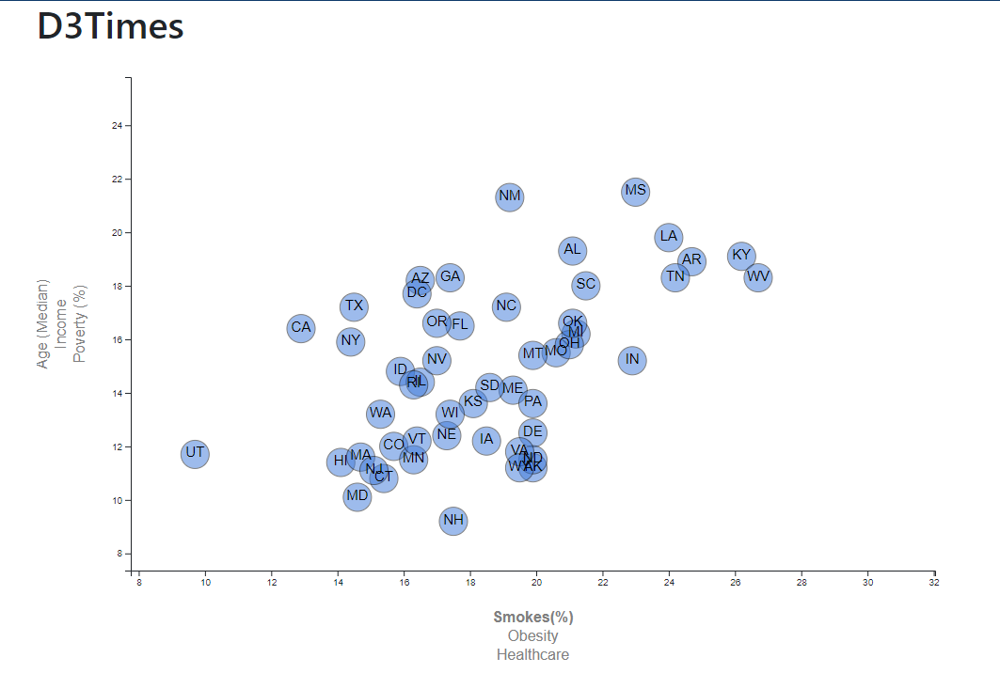
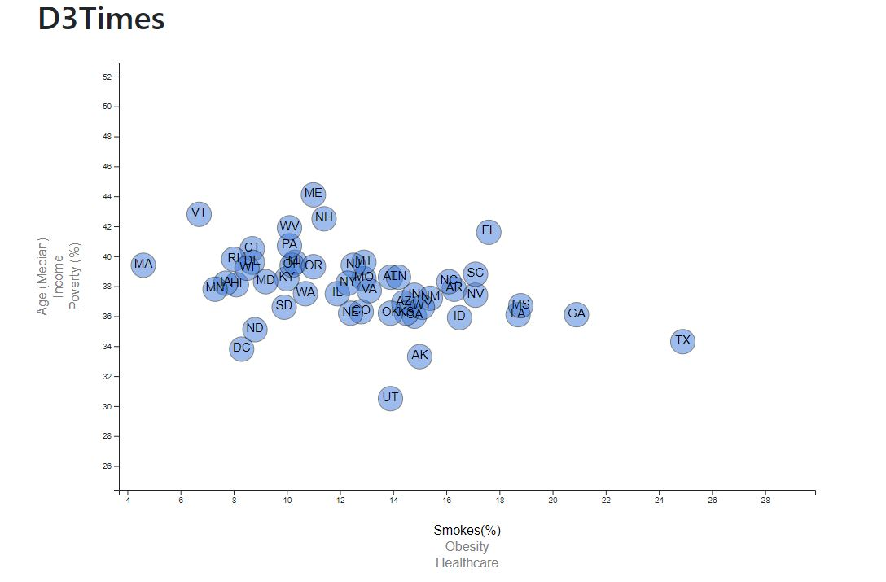

# Data Journalism and D3

As a journalistic data visualist tasked with analyzing the current trends affecting the daily lives of readers, the creation of visual graphics, charts and interactive displays seemed only appropriate.    

Here we see factors such as Age(Median), Income, Poverty and Obesity broken down by state.  

The data set is based on 2014 ACS 1-year estimates from the [US Census Bureau](https://data.census.gov/cedsci/).

Below is a visualization which shows the Poverty rate and percentage of Smokers per state.

